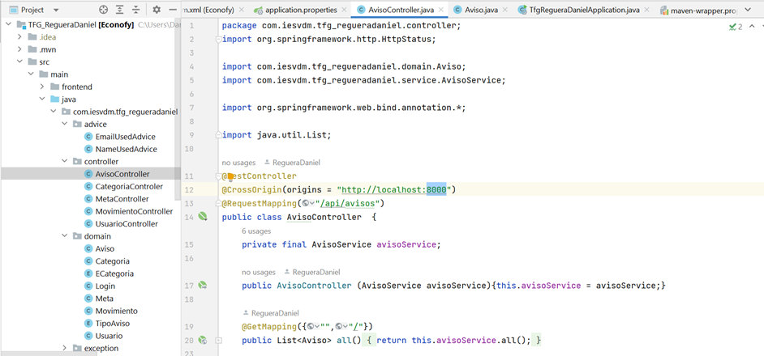

# ECONOFY

ECONOFY es una aplicación web desarrollada con Spring Boot para la gestión de gastos y ahorros personales .


> (Las imágenes utilizadas para la nimación pertenecen a la versión beta de la web)


# Descripción
La aplicación proporciona las siguientes características principales:

•	Recopilar información útil sobre su economía y estadísticas.

•	Categorizar los gastos, analizar y contrastarlos con el total.

•	Mostar en un dashboard la representación gráfica de los gastos para que sean más entendibles de un solo vistazo.

•	Podrá marcar máximos mensuales ya sea de forma global y/o por categoría.

•	Crear categorías propias para controlar dichos gastos.

•	Tener un calendario para futuros gastos y estar prevenido de ellos.

•	Exportar los movimientos a Excel y CSV.

# Instalación, dependencias y sus versiones
Puedes clonar esta aplicación de una copia digital o bien descargarla de su repositorio: https://github.com/RegueraDaniel/Intellij_TFG_RegueraDaniel

Para iniciar la parte de **front** deberás ubicarte en la carpeta adecuada (~\TFG_RegueraDaniel\src\main\frontend) y ejecutar en la tu CMD este comando que evitará los problemas de incompatibilidades entre las librerías:

`npm install --force`

Importante: la ruta para el front es http://localhost:8000 y estas son las dependencias (package.json):

```json
{
  "name": "ant-design-pro",
  "version": "6.0.0",
  "private": true,
  "description": "An out-of-box UI solution for enterprise applications",
  "scripts": {
    "analyze": "cross-env ANALYZE=1 max build",
    "build": "max build",
    "deploy": "npm run build && npm run gh-pages",
    "dev": "npm run start:dev",
    "gh-pages": "gh-pages -d dist",
    "i18n-remove": "pro i18n-remove --locale=zh-CN --write",
    "postinstall": "max setup",
    "jest": "jest",
    "lint": "npm run lint:js && npm run lint:prettier && npm run tsc",
    "lint-staged": "lint-staged",
    "lint-staged:js": "eslint --ext .js,.jsx,.ts,.tsx ",
    "lint:fix": "eslint --fix --cache --ext .js,.jsx,.ts,.tsx --format=pretty ./src ",
    "lint:js": "eslint --cache --ext .js,.jsx,.ts,.tsx --format=pretty ./src",
    "lint:prettier": "prettier -c --write \"**/**.{js,jsx,tsx,ts,less,md,json}\" --end-of-line auto",
    "openapi": "max openapi",
    "prepare": "husky install",
    "prettier": "prettier -c --write \"**/**.{js,jsx,tsx,ts,less,md,json}\"",
    "preview": "npm run build && max preview --port 8000",
    "record": "cross-env NODE_ENV=development REACT_APP_ENV=test max record --scene=login",
    "serve": "umi-serve",
    "start": "cross-env UMI_ENV=dev max dev",
    "start:dev": "cross-env REACT_APP_ENV=dev MOCK=none UMI_ENV=dev max dev",
    "start:no-mock": "cross-env MOCK=none UMI_ENV=dev max dev",
    "start:pre": "cross-env REACT_APP_ENV=pre UMI_ENV=dev max dev",
    "start:test": "cross-env REACT_APP_ENV=test MOCK=none UMI_ENV=dev max dev",
    "test": "jest",
    "test:coverage": "npm run jest -- --coverage",
    "test:update": "npm run jest -- -u",
    "tsc": "tsc --noEmit"
  },
  "lint-staged": {
    "**/*.{js,jsx,ts,tsx}": "npm run lint-staged:js",
    "**/*.{js,jsx,tsx,ts,less,md,json}": [
      "prettier --write"
    ]
  },
  "browserslist": [
    "> 1%",
    "last 2 versions",
    "not ie <= 10"
  ],
  "dependencies": {
    "@ant-design/charts": "^1.4.2",
    "@ant-design/icons": "^4.8.0",
    "@ant-design/pro-components": "^2.4.16",
    "@ant-design/use-emotion-css": "1.0.4",
    "@umijs/route-utils": "^2.2.2",
    "antd": "^5.5.1",
    "classnames": "^2.3.2",
    "file-saver": "^2.0.5",
    "lodash": "^4.17.21",
    "moment": "^2.29.4",
    "omit.js": "^2.0.2",
    "querystring": "^0.2.1",
    "rc-menu": "^9.9.2",
    "rc-util": "^5.32.2",
    "react": "^18.2.0",
    "react-dev-inspector": "^1.8.4",
    "react-dom": "^18.2.0",
    "react-helmet-async": "^1.3.0",
    "sheetjs-style": "^0.15.8"
  },
  "devDependencies": {
    "@ant-design/pro-cli": "^2.1.5",
    "@testing-library/react": "^13.4.0",
    "@types/classnames": "^2.3.1",
    "@types/express": "^4.17.17",
    "@types/history": "^4.7.11",
    "@types/jest": "^29.5.1",
    "@types/lodash": "^4.14.195",
    "@types/react": "^18.2.7",
    "@types/react-dom": "^18.2.4",
    "@types/react-helmet": "^6.1.6",
    "@umijs/fabric": "^2.14.1",
    "@umijs/lint": "^4.0.69",
    "@umijs/max": "^4.0.69",
    "cross-env": "^7.0.3",
    "eslint": "^8.41.0",
    "express": "^4.18.2",
    "gh-pages": "^3.2.3",
    "husky": "^7.0.4",
    "jest": "^29.5.0",
    "jest-environment-jsdom": "^29.5.0",
    "lint-staged": "^10.5.4",
    "mockjs": "^1.1.0",
    "prettier": "^2.8.8",
    "swagger-ui-dist": "^4.19.0",
    "ts-node": "^10.9.1",
    "typescript": "^5.0.0",
    "umi-presets-pro": "^2.0.3"
  },
  "engines": {
    "node": ">=12.0.0"
  },
  "create-umi": {
    "ignoreScript": [
      "docker*",
      "functions*",
      "site",
      "generateMock"
    ],
    "ignoreDependencies": [
      "netlify*",
      "serverless"
    ],
    "ignore": [
      ".dockerignore",
      ".git",
      ".github",
      ".gitpod.yml",
      "CODE_OF_CONDUCT.md",
      "Dockerfile",
      "Dockerfile.*",
      "lambda",
      "LICENSE",
      "netlify.toml",
      "README.*.md",
      "azure-pipelines.yml",
      "docker",
      "CNAME",
      "create-umi"
    ]
  }
}

```

Para el **back** es recomendable usar el mismo ide con el que se programó: IntelliJ IDEA 2022.3. 

Lo primero es configurar el servidor y su conexión con la base de datos (en nuestro caso, workbench) que podrás encontrar en ~\TFG_RegueraDaniel\src\main\resources\application.properties. Es importante que en las dos primeras líneas sustituyas los valores [tuUsuarioBdd (nombre de **usuario**) y tuPassBdd (**contraseña**) incluido los asteriscos] por los que tienes en tu base de datos.


```javascript
spring.datasource.url=jdbc:mysql://localhost:3306/econofy?createDatabaseIfNotExist=true
spring.datasource.username= ***tuUsuarioBdd***
spring.datasource.password= ***tuPassBdd***
spring.datasource.driver-class-name=com.mysql.cj.jdbc.Driver
#datasource
spring.datasource.name=econofy
spring.datasource.generate-unique-name=false

#jpa
spring.jpa.database-platform=org.hibernate.dialect.MySQLDialect
spring.jpa.show-sql=true

spring.jpa.generate-ddl=true
spring.jpa.hibernate.ddl-auto=update

spring.jackson.serialization.FAIL_ON_EMPTY_BEANS=false

```

Nuestro back apunta al puerto 8080. Si quieres cambiar la de tu front, deberar alterar cada en cada uno de los controladores ( ~TFG_RegueraDaniel\src\main\java\com\iesvdm\tfg_regueradaniel\controller\) el valor de la variable @Crossorigin que puedes ver en esta imagen:



Una vez configurado el servidor bastará con arrancarlo. Cuando haya cargado por completo podremos poner en nuestro navegador la ruta del front y podremos usar la aplicación.

Estas son las dependencias del back (pom.xml):

```json
<?xml version="1.0" encoding="UTF-8"?>
<project xmlns="http://maven.apache.org/POM/4.0.0" xmlns:xsi="http://www.w3.org/2001/XMLSchema-instance"
         xsi:schemaLocation="http://maven.apache.org/POM/4.0.0 https://maven.apache.org/xsd/maven-4.0.0.xsd">
    <modelVersion>4.0.0</modelVersion>
    <parent>
        <groupId>org.springframework.boot</groupId>
        <artifactId>spring-boot-starter-parent</artifactId>
        <version>3.0.3</version>
        <relativePath/> <!-- lookup parent from repository -->
    </parent>
    <groupId>com.example</groupId>
    <artifactId>Econofy</artifactId>
    <version>0.0.1-SNAPSHOT</version>
    <name>TFG_RegueraDaniel</name>
    <description>TFG_RegueraDaniel</description>
    <properties>
        <java.version>17</java.version>
    </properties>
    <dependencies>
        <dependency>
            <groupId>org.springframework.boot</groupId>
            <artifactId>spring-boot-starter-data-jpa</artifactId>
        </dependency>
        <dependency>
            <groupId>org.springframework.boot</groupId>
            <artifactId>spring-boot-starter-validation</artifactId>
        </dependency>
        <dependency>
            <groupId>org.springframework.boot</groupId>
            <artifactId>spring-boot-starter-web</artifactId>
        </dependency>
        <dependency>
            <groupId>org.springframework.security</groupId>
            <artifactId>spring-security-core</artifactId>
            <version>[3.2.0,4.0.0]</version>
        </dependency>
        <dependency>
            <groupId>org.springframework.boot</groupId>
            <artifactId>spring-boot-devtools</artifactId>
            <scope>runtime</scope>
            <optional>true</optional>
        </dependency>
        <dependency>
            <groupId>com.mysql</groupId>
            <artifactId>mysql-connector-j</artifactId>
            <scope>runtime</scope>
        </dependency>
        <dependency>
            <groupId>org.projectlombok</groupId>
            <artifactId>lombok</artifactId>
            <optional>true</optional>
        </dependency>
        <dependency>
            <groupId>org.springframework.boot</groupId>
            <artifactId>spring-boot-starter-test</artifactId>
            <scope>test</scope>
        </dependency>
        <dependency>
            <groupId>org.jetbrains</groupId>
            <artifactId>annotations</artifactId>
            <version>RELEASE</version>
            <scope>compile</scope>
        </dependency>
    </dependencies>
    <build>
        <plugins>
            <plugin>
                <groupId>org.springframework.boot</groupId>
                <artifactId>spring-boot-maven-plugin</artifactId>
                <configuration>
                    <excludes>
                        <exclude>
                            <groupId>org.projectlombok</groupId>
                            <artifactId>lombok</artifactId>
                        </exclude>
                    </excludes>
                </configuration>
            </plugin>
        </plugins>
    </build>
</project>

```

Dentro de los test, en la carpeta Postman (\TFG_RegueraDaniel\src\test\Postman) podrás encontrar las pruebas realizadas durante el desarrollo; si quieres hacer las tuyas es recomendable que revises los Json de las últimas pruebas (están relacionadas con las tareas de GitHub).

